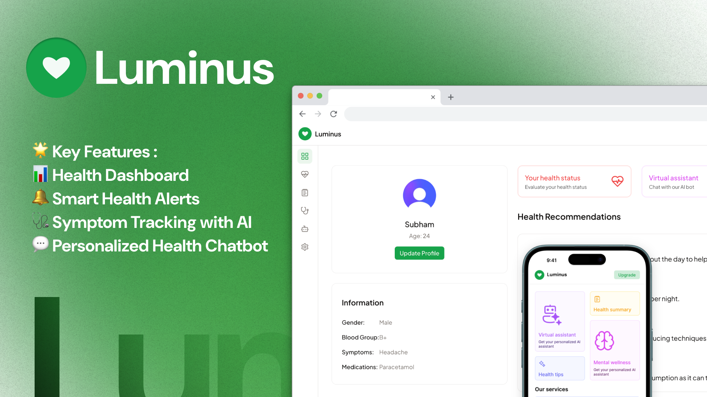

<div align="center">
  
  # 🩺 Luminus - Your Personal AI Health Assistant
  
  
  <p>
   <strong>A cutting-edge AI-powered health management platform that puts your wellness first</strong>
  </p>
  
</div>

---

## 🌟 About Luminus

Luminus is a revolutionary AI-powered health assistant that transforms how you monitor and manage your well-being. Built with modern technologies including Next.js, Clerk authentication, Stripe payments, Prisma ORM, and MongoDB, Luminus delivers real-time health insights and personalized recommendations to help you maintain optimal wellness.

### Why Luminus?

- **🤖 AI-First Approach**: Leveraging Google's Gemini API for intelligent health insights
- **📱 Modern Interface**: Beautiful, responsive design built with Tailwind CSS and Shadcn UI
- **🔒 Secure**: Enterprise-grade authentication and data protection
- **💰 Affordable**: Premium features for just $9 - no recurring subscriptions

## 🚀 Features

### Core Features

- **📊 Health Dashboard**: Comprehensive overview of your health metrics and trends
- **💊 Medication Tracking**: Never miss a dose with smart medication reminders
- **🩺 Symptom Monitoring**: Log and track symptoms with AI-powered analysis
- **💬 AI Health Chat**: Get instant answers and personalized health advice
- **📈 Health Analytics**: Visual insights into your wellness journey

### Premium Features

- **🎯 Advanced Recommendations**: Personalized health plans and suggestions
- **📋 Detailed Reports**: Export comprehensive health reports
- **🔔 Smart Notifications**: Intelligent reminders and health alerts
- **📞 Priority Support**: Direct access to health assistance

## 🌐 Live Demo

🔗 **[Try Luminus Live](https://luminus-ai-subham.vercel.app)**


## 💻 Tech Stack

<div align="center">

| Frontend                                                                                                 | Backend                                                                                               | Database                                                                                                 | Auth                                                                                               | Payments                                                                                              | AI                                                                                                       |
| -------------------------------------------------------------------------------------------------------- | ----------------------------------------------------------------------------------------------------- | -------------------------------------------------------------------------------------------------------- | -------------------------------------------------------------------------------------------------- | ----------------------------------------------------------------------------------------------------- | -------------------------------------------------------------------------------------------------------- |
|  |  |  |  |  |  |

</div>

### 🎨 UI & Styling

- **Tailwind CSS** - Utility-first CSS framework
- **Shadcn UI** - Modern React component library
- **Headless UI** - Unstyled, accessible UI components
- **Framer Motion** - Smooth animations and transitions

### 🔧 State Management & Data Fetching

- **Zustand** - Lightweight state management
- **TanStack Query** - Powerful data synchronization
- **Zod** - TypeScript-first schema validation

### 🛠️ Development Tools

- **TypeScript** - Type-safe JavaScript
- **ESLint** - Code linting and formatting
- **Prettier** - Code formatting

## 🚦 Usage

### For Users

1. **Sign Up**: Create your account using email or social login
2. **Complete Onboarding**: Set up your health profile
3. **Start Tracking**: Log symptoms, medications, and health data
4. **Chat with AI**: Get personalized health insights
5. **Upgrade**: Unlock premium features for enhanced experience

### For Developers

1. **Component Library**: Explore reusable components in `/src/components`
2. **API Routes**: Check server actions in `/src/actions`
3. **Database Schema**: Review Prisma models in `/prisma/schema.prisma`
4. **Styling**: Customize themes in `/src/styles/globals.css`

## 🏗️ Project Structure

```
luminus/
├── 📁 prisma/
│   └── schema.prisma          # Database schema
├── 📁 public/
│   ├── icons/                 # App icons and logos
│   └── images/                # Static images
├── 📁 src/
│   ├── 📁 actions/            # Server actions
│   ├── 📁 app/                # Next.js app router
│   │   ├── (marketing)/       # Marketing pages
│   │   ├── auth/              # Authentication pages
│   │   ├── dashboard/         # Protected dashboard
│   │   └── onboarding/        # User onboarding
│   ├── 📁 components/         # Reusable components
│   │   ├── dashboard/         # Dashboard-specific
│   │   ├── global/            # Global components
│   │   ├── modals/            # Modal dialogs
│   │   ├── navigation/        # Navigation components
│   │   ├── onboarding/        # Onboarding steps
│   │   └── ui/                # Base UI components
│   ├── 📁 constants/          # App constants
│   ├── 📁 hooks/              # Custom React hooks
│   ├── 📁 lib/                # Utility libraries
│   ├── 📁 styles/             # Global styles
│   ├── 📁 types/              # TypeScript types
│   └── 📁 utils/              # Helper functions
└── 📄 Configuration files
```

## � Roadmap

- [ ] **Mobile App**: React Native implementation
- [ ] **Wearable Integration**: Apple Watch & Fitbit support
- [ ] **Telemedicine**: Video consultations
- [ ] **Multi-language Support**: Internationalization
- [ ] **Advanced Analytics**: ML-powered health predictions
- [ ] **API Access**: Developer API for third-party integrations

## 💖 Support the Project

If Luminus has helped you manage your health better, consider supporting the project:

<div align="center">
  
  [](https://github.com/ItisSubham/Luminus)
  
</div>

---

<div align="center">
  <p>
    <em>Making healthcare accessible, one line of code at a time</em>
  </p>
  
  [](https://github.com/yourusername/luminus)
  [](https://nextjs.org/)
  [](https://ai.google.dev/)
</div>
